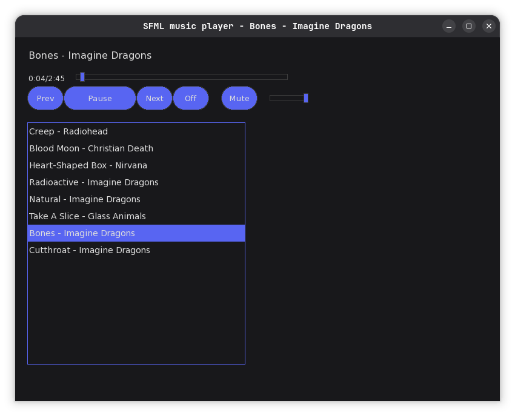

# SFML Music Player
A cross-platform desktop music player built in C++ using SFML for audio playback and TGUI for the graphical interface.

The application supports playlist management, playback controls, and a modern UI.

## 🚀 Quick Start
```bash
git clone https://github.com/omarch-dev/sfml-music-player.git
cd sfml-music-player
./run.sh
```

## Features
- Supports common audio formats (WAV, OGG, MP3*)
- Opus support planned
- Playlist management
- Pause / Resume / Stop controls
- Cross-platform support (Linux / Windows)
- GUI built with TGUI

## 🎵 Interface Preview


## Dependencies
- C++17 or newer
- SFML
- TGUI
- CMake (optional)

## Build Instructions
### Linux (Arch)
Install dependencies:
```bash
paru -S gcc gdb sfml tgui-git
```

Then build:
``` bash
g++ -std=c++20 main.cpp Player.cpp PlayList.cpp -o sfml-player -ltgui -lsfml-graphics -lsfml-window -lsfml-system -lsfml-audio
```

Or run:
```bash
./run.sh
```

## Usage
Run the program:
``` bash
./sfml-player
```

Use the interface to:
- Add songs
- Control playback

## Future Improvements

- Drag & drop support
- Support for more audio types
- Equalizer
- Save/load playlists
- Better UI
- Theme support